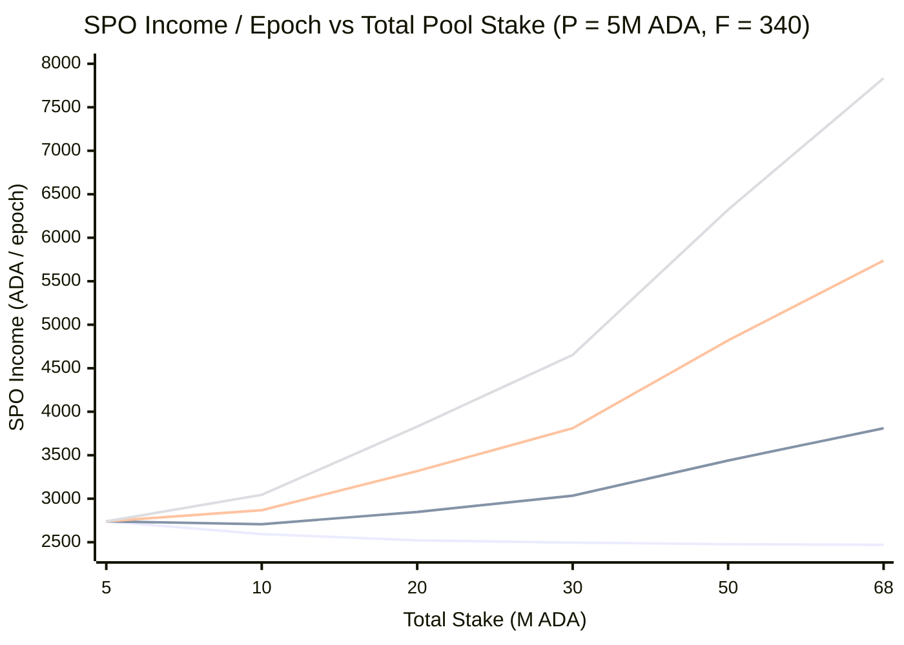
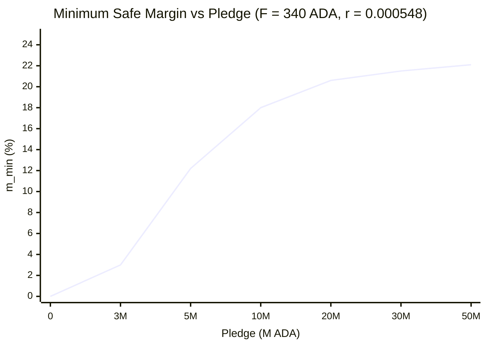
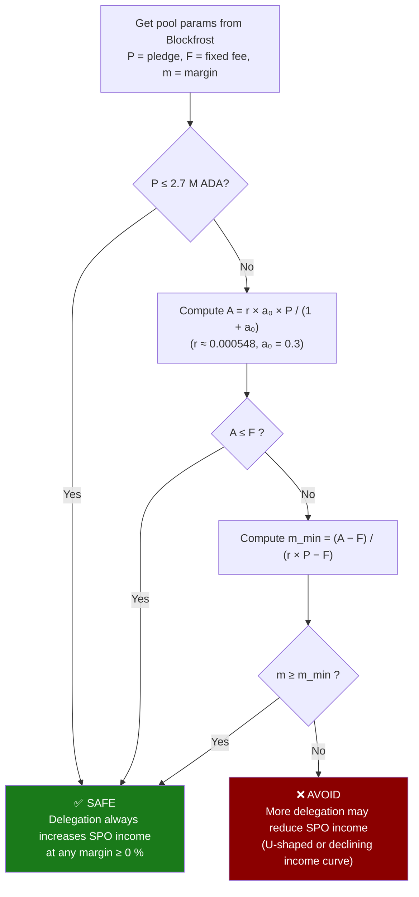

# SPO Reward Analysis for Pool Ranger Delegation

**Purpose:** Understand how delegation affects Stake Pool Operator (SPO) income so that Pool
Ranger only delegates to pools where adding delegation never hurts the SPO.

---

## 1. Parameter Reference

| Symbol | Meaning | Current value |
|--------|---------|---------------|
| `r` | Per-epoch reward rate | ≈ 0.000548 (≈ 4 % / 73 epochs/yr) |
| `a₀` | Pledge influence factor | 0.3 (protocol parameter) |
| `k` | Target number of pools | 500 (protocol parameter) |
| `F` | Fixed fee (ADA / epoch) | 170 to 340 ADA (SPO-set, min enforced) |
| `m` | Margin (0% to 100%) | SPO-set |
| `P` | Pledge (ADA) | SPO-set |
| `S` | Total pool stake = P + external delegation | varies |
| `S_sat` | Saturation point ≈ active_stake / k | ≈ 65–75 M ADA (2026) |
| `A` | Pledge bonus per epoch (defined below) | derived |

> **Note:** `r` drifts downward over time as the reserve depletes. Recompute periodically
> from recent epoch data or use the current Cardano staking calculator rate.

---

## 2. Gross Pool Rewards per Epoch

```
gross(S, P) = r × (S + a₀ × P) / (1 + a₀)
```

This splits into two separate contributions:

| Component | Formula | Behaviour as delegation grows |
|-----------|---------|-------------------------------|
| Proportional stake | `r × S / (1 + a₀)` | **Increases** with every new delegator |
| Pledge bonus `A` | `r × a₀ × P / (1 + a₀)` | **Constant** — fixed for a given pledge |

The pledge bonus `A` is the key insight: it is a **fixed absolute amount** per epoch that
does not grow when more delegators join. All the growth from new delegation comes from the
proportional stake term.

---

## 3. SPO Income per Epoch

```
operator_fee  = F + m × (gross − F)
pledge_return = (P / S) × (1 − m) × (gross − F)

SPO_total     = operator_fee + pledge_return
              = F + (gross − F) × [ m + (P / S) × (1 − m) ]
```

As delegation grows and S increases, the pledge fraction `P/S` shrinks. The SPO keeps less
and less of the growing staker pool unless the margin `m` compensates.

---

## 4. When Does Adding Delegation Hurt the SPO?

Taking the derivative of `SPO_total` with respect to `S`:

```
d(SPO_total)/dS = m × r/(1+a₀)   +   P × (1−m) × (F − A) / S²
                  ───────────────     ───────────────────────────
                  margin term (+)     pledge-dilution term (sign depends on A vs F)
```

### Case 1 — `A ≤ F` (pledge bonus ≤ fixed fee)

Both terms are non-negative. Income **always increases** with delegation at any margin. ✓

### Case 2 — `A > F` (pledge bonus > fixed fee)

The pledge-dilution term is **negative**. If the margin term is too small to overcome it,
adding delegation **reduces** SPO income.

This happens when:
- Margin `m` is very small (or zero)
- Pool size `S` is small (the `1/S²` factor amplifies the effect)
- Pledge `P` is large (both `A` and `P` grow the negative term)

---

## 4.1 When Does Delegation Reduce Delegator ROA?

The previous section showed that SPO income can fall with more delegation. Equally
surprising: **delegator ROA can also fall with more delegation**, and the condition is
identical — it depends entirely on whether the pledge bonus `A` exceeds the fixed fee `F`.

### Deriving the direction of ROA change

Expanding the ROA formula:

```
ROA  =  (1 − m) × (gross − F) / S × 73 × 100%

     =  (1 − m) × [ r/(1+a₀) + (A − F)/S ] × 73 × 100%
```

Taking the derivative with respect to S (holding all pool parameters fixed):

```
dROA/dS  =  (1 − m) × [ −(A − F) / S² ] × 73 × 100%
```

The sign of this derivative is determined entirely by whether `A > F`:

| Condition | `dROA/dS` | Effect on ROA as delegation grows |
|-----------|-----------|----------------------------------|
| `A ≤ F`   | ≥ 0       | ROA **increases** — more delegators always help |
| `A > F`   | < 0       | ROA **decreases** — every new delegator dilutes the pledge bonus |
| `A = F`   | = 0       | ROA is constant regardless of delegation level |

Unlike SPO income (which has a U-shape when `0 < m < m_min`), delegator ROA has **no
U-shape** — it is strictly monotone in one direction for the life of the pool.

### Why the pledge bonus dilutes

When `A > F`, a large fraction of the pool's gross reward is concentrated pledge bonus.
That bonus is a fixed ADA amount per epoch that is then split pro-rata across all stakers.
When only the SPO's own pledge is in the pool, the SPO captures the entire bonus; as
external delegators arrive, each one claims a slice, reducing every other staker's share.
The per-ADA return for any individual delegator therefore falls — they are each dividing the
same fixed bonus pie into more pieces.

The asymptotic limit of ROA as delegation grows very large is:

```
ROA∞  =  (1 − m) × r / (1 + a₀) × 73 × 100%
       ≈  (1 − 0.05) × 0.000548 / 1.3 × 73 × 100%
       ≈  2.92 %  (at m = 5 %)
```

A high-pledge pool (e.g. P = 5 M ADA) starts at around 3.3 % ROA for the very first
delegator and converges toward 2.9 % as it fills up toward saturation.

### The corollary — low-pledge pools reward later delegators more

When `A ≤ F`, the fixed fee overhead dominates. Early delegators carry a disproportionate
share of the fixed fee cost; as more people join, the fee is spread thinner and per-ADA ROA
improves for everyone. Being the sole delegator in a small, low-pledge pool is actually the
worst position for ROA.

### Interaction with the Delegation Safety banner

This produces a subtle split outcome:

| Banner | A vs F | SPO income as delegation grows | Delegator ROA as delegation grows |
|--------|--------|-------------------------------|----------------------------------|
| ✅ SAFE | A ≤ F | Increases | Increases |
| ✅ SAFE | A > F, m ≥ m_min | Increases | **Decreases** |
| ❌ AVOID | A > F, m < m_min | U-shape (dips then rises) | Decreases |

The middle row is the most counterintuitive: a pool can show ✅ SAFE (meaning the SPO
is never harmed by delegation) while every new delegator simultaneously erodes the
per-ADA ROA for all existing delegators. The cooperative relationship with the SPO is
intact, but delegators are in mild competition with each other for the fixed pledge bonus.

### What to look for in the interactive chart

Set **Pledge = 5 M ADA**, **Fixed Fee = 340**, **Margin = 12 %** (≈ m_min, so banner is
✅ SAFE). The **green** SPO income curve rises monotonically. The **blue** delegator ROA
curve slopes gently downward from left to right. Both curves are always present
simultaneously; the safety banner tells you only about the green curve's direction.

To see both curves rise together, reduce Pledge below **2.7 M ADA** (A ≤ F threshold):
the blue curve will now slope upward, confirming that each new delegator helps everyone.

---

## 5. SPO Income vs. Delegation — Worked Example

Pool parameters: **P = 5 M ADA**, **F = 340 ADA**

| Total stake S | Gross/epoch | m = 0 % | m = 5 % | m = 12 % | m = 20 % |
|---:|---:|---:|---:|---:|---:|
| 5 M (pledge only) | 2,740 | **2,740** | **2,740** | **2,740** | **2,740** |
| 10 M | 4,848 | 2,594 ▼ | 2,707 ▼ | 2,868 ▲ | 3,045 ▲ |
| 20 M | 9,063 | 2,521 ▼ | 2,848 ▲ | 3,317 ▲ | 3,829 ▲ |
| 30 M | 13,278 | 2,496 ▼ | 3,035 ▲ | 3,810 ▲ | 4,653 ▲ |
| 50 M | 21,709 | 2,477 ▼ | 3,439 ▲ | 4,820 ▲ | 6,323 ▲ |
| 68 M (≈ sat.) | 29,297 | 2,469 ▼ | 3,810 ▲ | 5,737 ▲ | 7,834 ▲ |

- **m = 0 %** — income falls monotonically; every new delegator makes the SPO worse off.
- **m = 5 %** — U-shape: income dips to a minimum near S ≈ 8 M then rises.
- **m = 12 %** — borderline safe: income is flat at S = P then rises. (12.18% is exact m_min for P = 5 M.)
- **m = 20 %** — income rises throughout.

### Chart



---

## 6. Minimum Safe Margin Formula

For delegation to **always increase** SPO income from any pool size up to saturation, the
binding constraint occurs at the smallest S, which is S = P (pledge only, no external
delegation yet). Solving `d(SPO)/dS ≥ 0` at S = P gives:

### Step 1 — Is the pool automatically safe?

```
A  =  r × a₀ × P / (1 + a₀)        (pledge bonus per epoch, in ADA)

If  A ≤ F  →  pool is safe at any margin ≥ 0 %
```

The threshold pledge below which any pool is automatically safe:

```
P_safe  =  F × (1 + a₀) / (r × a₀)
         =  340 × 1.3 / (0.000548 × 0.3)
         ≈  2,690,000 ADA   (~2.7 M ADA at current parameters)
```

### Step 2 — If pledge > 2.7 M ADA, compute m_min

```
m_min  =  (A − F) / (r × P − F)

       =  [ r × a₀ × P / (1+a₀) − F ]
          ─────────────────────────────
                 r × P − F
```

The margin must be at or above `m_min` for delegation to always help the SPO.

### Ceiling — no pool ever requires more than 23.1 %

As P → ∞, `m_min` approaches `a₀ / (1 + a₀) = 0.3 / 1.3 ≈ 23.08 %`. No matter how large
the pledge, a margin of **≥ 23.1 %** guarantees safe delegation for any pool.

---

## 7. m_min by Pledge Level (F = 340 ADA, r = 0.000548)

| Pledge (ADA) | A (ADA/epoch) | A > F? | m_min |
|---:|---:|:---:|---:|
| 0 – 2,690,000 | < 340 | No | **0 %** — always safe |
| 3,000,000 | 379 | Yes | **3.0 %** |
| 5,000,000 | 632 | Yes | **12.2 %** |
| 10,000,000 | 1,265 | Yes | **18.0 %** |
| 20,000,000 | 2,529 | Yes | **20.6 %** |
| 30,000,000 | 3,794 | Yes | **21.5 %** |
| 50,000,000 | 6,323 | Yes | **22.1 %** |
| Any amount | — | — | **< 23.1 %** (ceiling) |

> Higher fixed fees (F > 340) make pools **safer** — a larger F raises the threshold P and
> lowers m_min. Pools that charge more than the minimum fee are easier to delegate to.

### Chart — the safe zone boundary



A pool's `(pledge, margin)` combination that plots **above** this line is safe to delegate to.
Any combination that plots **on or below** the line may hurt the SPO as delegation grows.

---

## 8. Decision Logic for Pool Ranger



---

## 8.1 The Delegation Safety Banner — Plain-English Guide

The interactive chart shows a **✅ SAFE** or **❌ AVOID** pill in the "Delegation Safety"
metric card. The banner answers a single question at the **pool level** (not at the cursor
position):

> *Is this pool's margin high enough that the SPO always benefits from receiving more
> delegation — from zero external delegation all the way up to saturation?*

### What each state means

| State | Meaning |
|-------|---------|
| ✅ SAFE | The SPO's income strictly increases with every additional delegator. Delegating is cooperative and sustainable — no delegation level harms the SPO. |
| ❌ AVOID | At low delegation levels, more delegation **reduces** the SPO's income. The cooperative would be economically harming the SPO by arriving, creating an adversarial relationship that may incentivize lower performance or pool closure. |

### The intuition behind m_min

When a pool carries a large pledge, the **pledge bonus A** is substantial — the SPO earns
well even with no external delegators at all. As delegators arrive, the SPO's proportional
stake share `P/S` shrinks. If the margin `m` is too small, the margin cut of new delegator
rewards does not compensate for that shrinking pledge fraction, and the SPO is actually
worse off with each new delegation.

`m_min` is the minimum margin at which the margin term exactly compensates for the
pledge-dilution effect, guaranteeing that delegation always helps the SPO. It is computed
entirely from pool-level parameters — it does not depend on how much delegation has
arrived so far.

The banner checks `m ≥ m_min` and flips the moment the two cross. Because a high fixed fee
absorbs less of the gross reward into overhead, **higher F pools have a lower m_min** and
are generally safer to delegate to.

### Why the banner is global, not cursor-specific

The cursor slider reads off SPO income and delegator ROA at a single chosen delegation
level. The safety banner is different — it asks whether the SPO income curve is
**non-decreasing across the entire range** from S = P (pledge only, no external delegation)
up to saturation. A pool can look fine at a particular cursor position yet still have a dip
at smaller delegation levels early in its history; the banner catches that dip.

Practically: if the banner shows ❌ AVOID, you will typically see the green SPO-income line
drop to a local minimum before recovering. The banner turns ✅ SAFE the moment you raise the
margin slider past m_min, because the income curve flattens out and then rises monotonically.

---

## 9. Quick Checklist for Each Candidate Pool

- [ ] Look up pledge `P`, fixed fee `F`, and margin `m` (Blockfrost, pool.pm, adapools.org)
- [ ] Compute `A = 0.000548 × 0.3 × P / 1.3`
- [ ] If `A ≤ F` → ✅ delegate freely
- [ ] If `A > F` → compute `m_min = (A − F) / (0.000548 × P − F)` and check `m ≥ m_min`
- [ ] If unsure, use the conservative rule: **require m ≥ 23 %** — this covers every possible pledge level

---

## 10. Why This Matters for Pool Ranger Members

Pool Ranger's members delegate their staking keys to cooperative-chosen pools. If we
accidentally delegate to a pool whose SPO income shrinks with more delegation, two bad things
happen:

1. The SPO is economically harmed by our arrival — an adversarial relationship.
2. The pool may lower performance or exit — reducing member rewards.

Delegating only to pools that satisfy the safe-margin condition keeps the SPO relationship
cooperative and sustainable.

---

## 11. Interactive Chart

> **GitHub rendering note:** GitHub's Markdown renderer strips all JavaScript, so interactive
> sliders cannot be embedded in a `.md` file. The static Mermaid charts above are rendered by
> GitHub, but the interactive version requires opening the standalone HTML file below.

**Open <a href="https://johnshearing.github.io/pool_ranger/SPO_REWARD_ANALYSIS_CHART.html" target="_blank">SPO_REWARD_ANALYSIS_CHART.html</a> in a browser** for
a live, interactive version of the analysis above.

The <a href="https://johnshearing.github.io/pool_ranger/SPO_REWARD_ANALYSIS_CHART_COMPANION.html" target="_blank">SPO_REWARD_ANALYSIS_CHART_COMPANION.html</a> is found here.  

### What the interactive chart includes

| Slider | Range |
|--------|-------|
| Margin (m) | 0 % → 100 % |
| Pledge (P) | 0 → 70 M ADA |
| Fixed Fee (F) | 170 → 340 ADA / epoch |
| Epoch Rate (r) | 0.0003 → 0.0008 |
| Current delegation cursor | 0 → 70 M ADA (moves a red cursor line on the chart) |

The chart plots **SPO income (ADA/epoch)** on the left y-axis and
**delegator annual ROA (%)** on the right y-axis, both against external delegation
from 0 to 70 M ADA. An orange dashed line marks the approximate saturation point,
and the cursor dots show exact values at any delegation level you choose.

The metric cards above the chart display the live pledge bonus **A**, minimum safe
margin **m_min**, delegation safety status (✅ SAFE / ❌ AVOID), SPO income, and
delegator ROA at the cursor position.

### How to use it

- **Locally:**   
Clone this repo, then open (ranger/SPO_REWARD_ANALYSIS_CHART.html) in any modern browser.  
- **GitHub Pages:**  
This repo has Pages enabled (Settings → Pages → Deploy from branch)    
The file is served live at:  
<a href="https://johnshearing.github.io/pool_ranger/SPO_REWARD_ANALYSIS_CHART.html" target="_blank">SPO_REWARD_ANALYSIS_CHART.html</a>

---

## 12. Caveats and Limitations

| Item | Detail |
|------|--------|
| `r` varies | The epoch rate declines slowly as the ADA reserve depletes. Recalculate `A` and `m_min` once per quarter or whenever a major protocol change occurs. |
| `a₀ = 0.3` | This is a governable protocol parameter. If it changes, recalculate the 2.7 M ADA threshold and the 23.1 % ceiling using `P_safe = F(1+a₀)/(r·a₀)` and `ceil = a₀/(1+a₀)`. |
| Saturation | All analysis assumes the pool stays below saturation. An over-saturated pool's gross rewards are capped at the saturation level, but the SPO income direction analysis still holds within the capped range. |
| Pool performance | The formula assumes 100 % block-production performance. A pool that misses blocks earns proportionally less; the income direction analysis is unchanged. |
| Cross-term ignored | The full Cardano reward formula includes a small cross-term `−a₀·s²·(z₀−σ')/z₀`. For pools well below saturation this term is negligible; at high pledge and near-saturation it would slightly increase `m_min` estimates above. |
