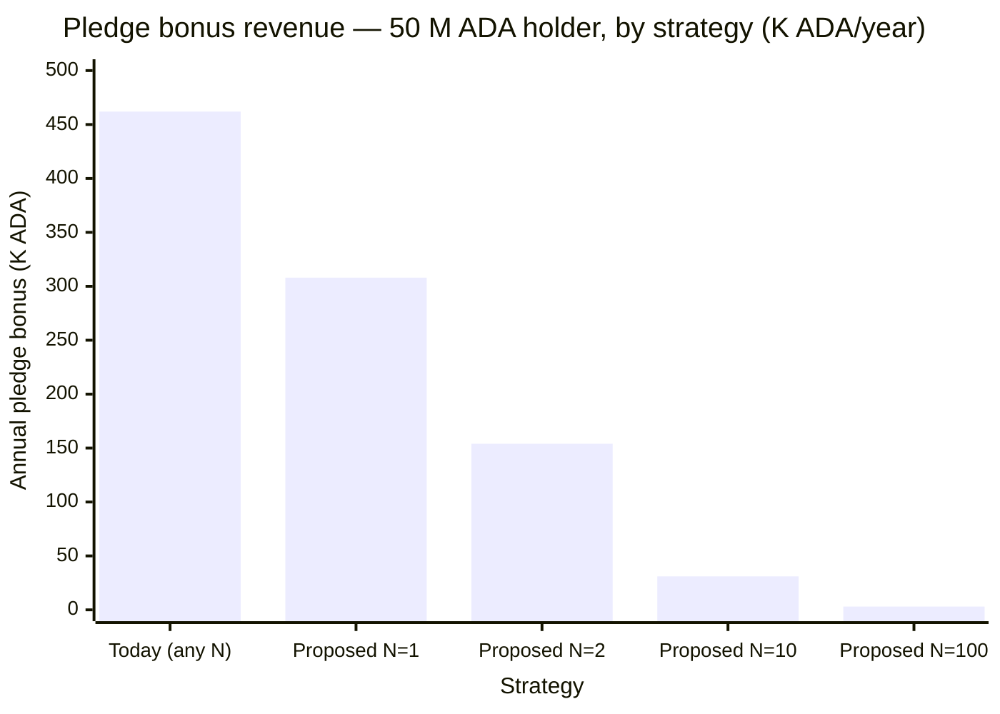

@Cerkoryn — thank you for taking the time to read the CIP carefully and to lay out the comparison in chart form.  
The five-pool table is a good frame for the discussion and makes it easier to answer you precisely.  
Let me take your two questions in order.

## On your chart

Your math is correct. Under the proposal `A_new = A_current · u` with `u = S / S_sat`, so Pool 3 (`u = 0.5`) earns half of today's pledge bonus. Pool 3 is the right pool to focus on — same pledge as Pool 2, half the delegation, half the proposed bonus.

| Pool       | Scenario           | Current bonus | Proposed bonus            |
| ---------- | ------------------ | ------------: | ------------------------: |
| Pool 1     | P = 100%, S = 100% |          100% |                      100% |
| Pool 2     | P =  50%, S = 100% |           50% |                       50% |
| **Pool 3** | **P =  50%, S =  50%** |       **50%** | **25%** &nbsp;← *halved* |
| Pool 4     | P =   0%, S = 100% |            0% |                        0% |
| Pool 5     | P =   0%, S =  50% |            0% |                        0% |

## Your first question — *"it appears to make pledge less important and saturation the dominating factor. Or am I misunderstanding?"*

You understand correctly, and that effect is intentional. The CIP states it directly:

> Pledge becomes a partnership claim, redeemed by attracting delegation rather than declared in isolation.

An empty pledged pool earns nothing from pledge. A half-utilized one earns half. The whole point is to make pledge contingent on demonstrated demand. The saturation case is preserved exactly — a saturated pool earns today's bonus — so no SPO already running a popular pool loses anything.

## Your second question — about the operator

Your operator-side analysis lands. Per-ADA-pledge return is roughly preserved across pool sizes today, because pledge rewards flow back to the same operator (effectively fee-free), and margin plus fixed fee on additional delegators give the operator a slice of every new ADA arriving. I won't dispute that framing — it's a fair operator observation, and the CIP doesn't actually claim that operator dilution is the problem it solves.

But the dilution the CIP names lives on the *delegator* side, not the operator side. Appendix A.3's worked example uses a 50 M-pledge pool with `F = 340`, `r = 0.000400`:

- `S = 50 M` (pledge only): `(A − F)/S ≈ 8.55 × 10⁻⁵`
- `S = 75 M` (saturated): `(A − F)/S ≈ 5.70 × 10⁻⁵`

That's a **≈ 0.21% absolute ROA loss** absorbed by delegators for the act of arriving at the pool. Per-delegator ROA falls as delegation arrives at a high-pledge pool — the protocol's stated Nash equilibrium (CIP-0084) assumes delegators rotate toward high-pledge, well-operated pools, and today's formula penalizes them in exactly the regime they're supposed to prefer. Under the proposal `A/S` becomes independent of `S` and the slope flips positive everywhere.

To be fully candid: there are parameter regimes (low margin, low fee, high pledge) where the *operator's* income curve also dips when delegators arrive — the "red zone" in the simulator — but those aren't typical pool parameters, so the delegator dilution above is the load-bearing argument, not the operator one.

## Structural wins beyond dilution

Even granting your operator point in full, two structural wins remain that don't depend on operator dilution at all:

**1. Cooperative bargaining surface.** A coordinator (Pool Ranger, or any large delegator) lifts `A_new / S` for every existing delegator by arriving, and drops it visibly by leaving. The threat of withdrawal becomes a publicly computable mathematical event, giving SPOs a continuous incentive to *retain* large delegators, not just attract them.

**2. MPO deterrence at the formula level.** `a₀` is untouched, so Sybil resistance via delegator preference is preserved exactly as it stands. On top of that, the proposal adds a formula-level cost for splitting. For a 50 M ADA holder (`r = 0.000548`, `a₀ = 0.3`, `S_sat = 75 M`, self-funded splits):

A 10-way self-funded split costs roughly **277 K ADA/year** in forgone bonus versus staying in one pool; today it costs zero. The cost grows linearly with N, and the formula-level deterrent compounds with the existing delegator-preference channel.

These two wins hold whether or not operators are diluted today.

## A visual walkthrough, if you'd like to step through it

I've added a guided presentation to the interactive simulator that walks through your two questions card-by-card, loads Pool 3 into the chart so the halved bonus is visible on the metric cards, and steps through the responses above:

[https://johnshearing.github.io/pool_ranger/CIP_UTILIZATION_SCALED_PLEDGE_BONUS.html](https://johnshearing.github.io/pool_ranger/CIP_UTILIZATION_SCALED_PLEDGE_BONUS.html)

Click the button **"▶ A reviewer's questions about Pool 3 — answered card by card"** at the top, or press ▶ Play inside the card to let it run on its own. Eleven steps, ~2 minutes if autoplayed.

Thank you again for the careful read — your framing of Pool 3 sharpened the response, and I'd welcome any pushback on the delegator-side numbers or the MPO table, which are where the case actually lives.
